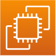

# NFT Authentication

  # :books: INDEX

- [:book: Project Introduction](#book-Project Introduction)

  - [Project Overview](#Project-Overview)
  - [Project Summary](#Project-Summary)
  - [Project Flowchart](#Project-Flowchart)
  <!-- - [DB Schema](#db-Schema) -->

- [:wrench: TECHNIQUE (Technique)](#wrench-사용-기술-technique)

  - [:hammer TECHNIQUE USED (Technique Used)](#기술-스택-technique-used)

    - [**FrontEnd**](#frontend)
    - [**BackEnd**](#backend)
    - [**Smart Contract**](#smart-contract)
    - [**Deploy**](#deploy)


    <!-- - [Deploy :rocket:](#deploy-rocket) -->
    <!-- - [Connect](#connect) -->

- [:computer: Service (Service)](#computer-Service-service)
- [:Project Review](#Project Review)

- [Demonstration video](#Demonstration video)
- [Review](#ProjectReview)

# :book: Project Introduct

## Project Overview

Difficulty in providing various career proofs, including employment for people with disabilities and entrepreneurship, poses significant challenges.

Especially, it is difficult to expect highly reliable services for verifying qualifications, such as educational achievements for people with disabilities.

To address the difficulty and problems in issuing disability certification documents, we aim to register and verify disability certification documents and provide information such as current disability grades, educational achievements, course history, and awards.

We will record such information on the blockchain with integrity and provide convenient access through a mobile application for easy verification.


## Project Summary


We will create an application that allows continuous authentication through simple QR code verification, similar to mobile electronic vaccination certificates.
This application will register certificates or educational credentials on the blockchain network to ensure high reliability and eliminate the need for reissuance. 
Users will be able to authenticate themselves through a simple QR code, enabling ongoing authentication.


## Project Flowchart

  

# :wrench: TECHNIQUE (Technique)
  


### FrontEnd

|                         Icon                         | Stack | Description     |
| :--------------------------------------------------: | :---: | --------------- |
|  | REACT | Frontend Development |

### Smart Contract

|                          Icon                           |  Stack   | Description          |
| :-----------------------------------------------------: | :------: | -------------------- |
|  | SOLIDITY | Creating API Server |
|   | TRUFFLE  | Testing Smart Contracts |
|    | ETHEREUM  | Blockchain Network    |
|   | GANACHE  | Local Testing     |

### Deploy

|                               Icon                                |        Stack        | Description                        |
| :---------------------------------------------------------------: | :-----------------: | ---------------------------------- |
|            |         EC2         |  Deployment server                 |
|        |      ROUTE 53       | onnecting DNS with EC2 server      |
|            | CERTIFICATE MANAGER | SSL certificate generation         |

## :construction:Architecture

  


# :computer: Service (Service)

## WalletConnect
<div>
<!-- web3 wallet connect -->


</div>

Connect to virtual currency wallet. The blockchain network used at this time is ethereum goeril testnet.

Additionally, you must access the domain from the browser tab of the cryptocurrency application, not from a web browser such as Safari or Chrome.


## Information registration procedure
<div>
<!-- 홈화면 이미지 -->


<!-- 정보 등록 이미지 -->


<!-- 정보 기입후 업로드 -->


</div>

The user's educational experience and personal information can be entered.

When you click the certificate upload button, the user's transaction signing event occurs.

## Information inquiry procedure
<div>
<!-- 동적qr정보조회 -->


</div>

<div>


</div>
Retrieves information recorded in the blockchain. Retrieves information recorded in ipfs.infura.

By searching the dynamic qr, you can search the information recorded by the user in the blockchain.


# SmartContract

```solidity
// 예시 솔리디티 코드
pragma solidity ^0.8.0;

 function safeMint(address to, string memory uri) public onlyOwner {
        uint256 tokenId = _tokenIdCounter.current();
        _tokenIdCounter.increment();
        _safeMint(to, tokenId);
        _setTokenURI(tokenId, uri); 
    }

When recording user information and meta information such as photos, the information is uploaded using ipfs.

    function tokenURI(uint256 tokenId)
        public
        view
        override(ERC721, ERC721URIStorage)
        returns (string memory)
    {
        return super.tokenURI(tokenId);
    }

When searching user information, enter tokenId to search information recorded in ipfs.
```
## Demonstration video
### Demonstration video-WalletConnect
https://github.com/wookjaegoo/NFT_authentication_lab_project/assets/87640934/ff798681-9062-44ce-9ba8-dfef6720f2c8
### Demonstration video-Registration
https://github.com/wookjaegoo/NFT_authentication_lab_project/assets/87640934/924a3ae5-7f07-4c83-ac2b-ff5a1ae20986
### Demonstration video-Information inquiry1
https://github.com/wookjaegoo/NFT_authentication_lab_project/assets/87640934/e64e894f-00e1-42c9-977d-d1d8d76ce890
### Demonstration video-Information inquiry2
https://github.com/wookjaegoo/NFT_authentication_lab_project/assets/87640934/df9d58a2-986d-4cbd-96cd-432ad3522b2e


# Project Review

### Technical Achievements
Using the IPFS Infura API, I recorded user metadata. 
I attempted to set up a local IPFS network without using IPFS Infura. The problem I encountered in this process was that the CID I registered on the IPFS network was not being announced, 
so even if I set up a local network, other users could not access the CID. To resolve this, 
I thoroughly read the IPFS docs and reconnected my local peers through port forwarding to establish a P2P network. Finally, I confirmed that the CID I registered was announced.

### Problem Solving

I realized that I could communicate with the blockchain network on mobile-responsive web using WalletConnectModal. 
However, on mobile devices, methods like ethereum.enable, which are used on PCs, cannot work because there are no Chrome extensions. 
Therefore, there is a disadvantage that users need to access the domain using a browser embedded in cryptocurrency applications such as MetaMask,
rather than using a conventional search engine from a user's perspective. I felt that accessibility was very low, 
and I judged that configuring the backend to construct user wallet information would reduce accessibility. In the next project, 
I will use the Klaytn network instead of Ethereum and proceed with a project that configures a server with user wallet information.

### Limitations
First, because personal information is recorded on the blockchain network, I felt that a flow in the form of DID rather than simple NFT is more appropriate. 
Unless access control is set on the IPFS network, proceeding with the DID method is constructive.
Also, in the early planning stages, the process of registering the certificate itself was complex, so to address this,
I had to proceed with implementing a smart contract with high reliability and automation. However, it proceeded as a simple procedure of recording personal information on the blockchain,
leaving a sense of regret.


