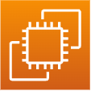

# NFT Authentication

# :books: 목차

- [:book: 프로젝트 소개](#book-프로젝트-소개)

  - [프로젝트 개요](#프로젝트-개요)
  - [프로젝트 요약](#프로젝트-요약)
  - [프로젝트 플로우차트](#프로젝트-플로우차트)
  <!-- - [DB 스키마](#db-스키마) -->

- [:wrench: 사용 기술 (Technique)](#wrench-사용-기술-technique)

  - [:hammer:기술 스택 (Technique Used)](#기술-스택-technique-used)

    - [**FrontEnd**](#frontend)
    - [**BackEnd**](#backend)
    - [**Smart Contract**](#smart-contract)
    - [**Deploy**](#deploy)

    - [Deploy :rocket:](#deploy-rocket)
    <!-- - [Connect](#connect) -->

- [:computer: 제공 기능 (Service)](#computer-제공-기능-service)

- [시연영상](#시연영상-계정지갑연결)

- [시연영상](#시연영상-등록 및 조회과정)


# :book: 프로젝트 소개

## 프로젝트 개요

장애인의 취업을 포함하여 창업 등 부가가치 행위를 위한 다양한 경력 증빙에 대한 어려움이 많다. 

특히 장애인 교육경력에 대한 자격 증명 등의 고신뢰성 서비스를 기대하기가 어렵다.

장애인 등급인증서를 등록 및 확인하여 현재 장애 등급 증명서 발급의 어려움 및 문제점을 해소

장애인 교육경력 인증서를 등록 및 확인하여 현재까지 진행한 학력, 수강 이력, 수상실적 등을 제공


## 프로젝트 요약

모바일 전자 예방접종 증명서와 유사한 개념으로 인증서나 교육경력 증명서를 블록체인 네트워크에 등록하여 

고신뢰성을 가지며 재발급의 필요 없이 간단한 본인인증을 해서 지속적인 인증이 가능한 어플리케이션 제작


## 프로젝트 플로우차트

  

# :wrench: 사용 기술 (Technique)
  


### FrontEnd

|                         Icon                         | Stack | Description     |
| :--------------------------------------------------: | :---: | --------------- |
|  | REACT | 프론트앤드 구성 |

### Smart Contract

|                          Icon                           |  Stack   | Description          |
| :-----------------------------------------------------: | :------: | -------------------- |
|  | SOLIDITY | 스마트 컨트랙트 작성 |
|   | TRUFFLE  | 스마트 컨트랙트 배포 |
|    | ETHEREUM  | 블록체인 네트워크    |
|   | GANACHE  | 로컬에서 테스트      |

### Deploy

|                               Icon                                |        Stack        | Description                        |
| :---------------------------------------------------------------: | :-----------------: | ---------------------------------- |
|            |         EC2         | 배포 서버                          |
|        |      ROUTE 53       | DNS와 EC2서버 연결                 |
|            | CERTIFICATE MANAGER | SSL 인증서 생성                    |

## :construction:Architecture

  


# :computer: 제공 기능 (Service)

<div>
<!-- 홈화면 이미지 -->


<!-- 정보 등록 이미지 -->


<!-- 정보 기입후 업로드 -->


</div>

사용자의 교육경력 및 개인정보를 입력할 수 있다. 

인증서 업로드 버튼을 클릭하면 사용자의 트랜잭션 서명 이벤트가 발생한다. 


<div>
<!-- web3 wallet connect -->


</div>

가상화폐 지갑과 연결한다 이때 사용한 블록체인 네트워크는 ethereum goeril testnet이다.

또한 사파리 혹은 크롬과 같은 웹 브라우저가 아닌 가상화폐 어플리케이션의 browser 탭에서 도메인에 접근해야한다.


<div>
<!-- 동적qr정보조회 -->


</div>

<div>


</div>

블록체인에 기록된 정보를 불러온다. ipfs.infura에 기록된 정보를 불러온다.

동적qr을 조회하면 사용자가 블록체인에 기록했던 정보를 조회할 수 있다.


### SmartContract

```solidity
// 예시 솔리디티 코드
pragma solidity ^0.8.0;

 function safeMint(address to, string memory uri) public onlyOwner {
        uint256 tokenId = _tokenIdCounter.current();
        _tokenIdCounter.increment();
        _safeMint(to, tokenId);
        _setTokenURI(tokenId, uri); 
    }

사용자의 정보를 기록할때 사진과 같은 메타정보를 기록하는경우 ipfs를 사용하여 정보를 업로드한다.

    function tokenURI(uint256 tokenId)
        public
        view
        override(ERC721, ERC721URIStorage)
        returns (string memory)
    {
        return super.tokenURI(tokenId);
    }

사용자의 정보를 조회할때는 tokenId를 입력하여 ipfs에 기록된 정보를 조회한다.
```

### 시연영상 - 계정지갑연결
https://github.com/wookjaegoo/NFT_authentication_lab_project/assets/87640934/ff798681-9062-44ce-9ba8-dfef6720f2c8
### 시연영상 - 등록과정
https://github.com/wookjaegoo/NFT_authentication_lab_project/assets/87640934/924a3ae5-7f07-4c83-ac2b-ff5a1ae20986
### 시연영상 - 조회과정1
https://github.com/wookjaegoo/NFT_authentication_lab_project/assets/87640934/e64e894f-00e1-42c9-977d-d1d8d76ce890
### 시연영상 - 조회과정2
https://github.com/wookjaegoo/NFT_authentication_lab_project/assets/87640934/df9d58a2-986d-4cbd-96cd-432ad3522b2e


